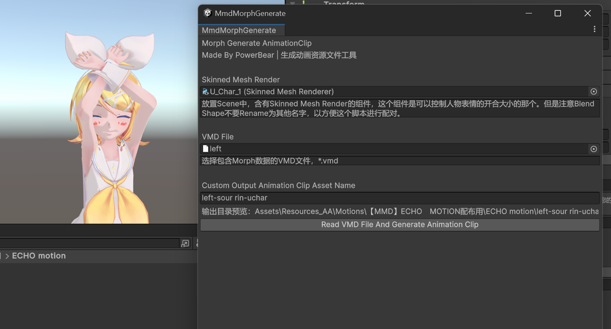
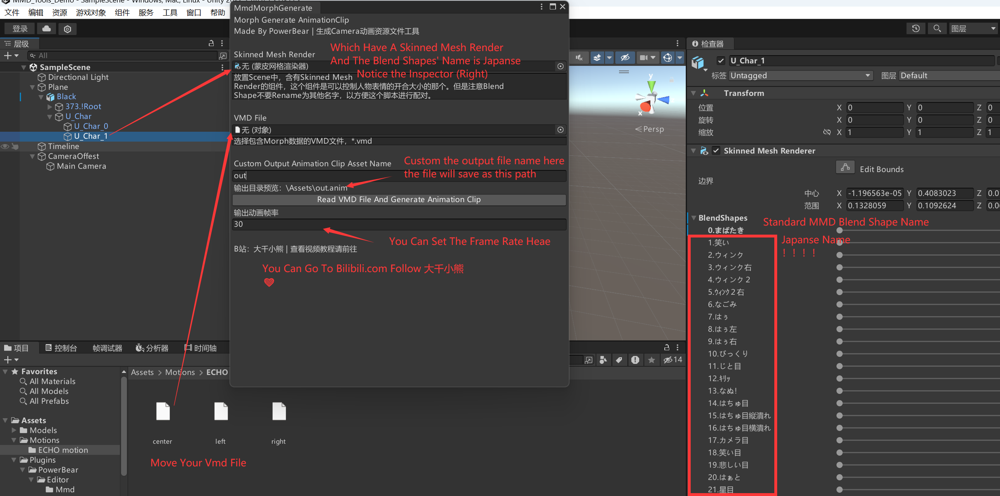
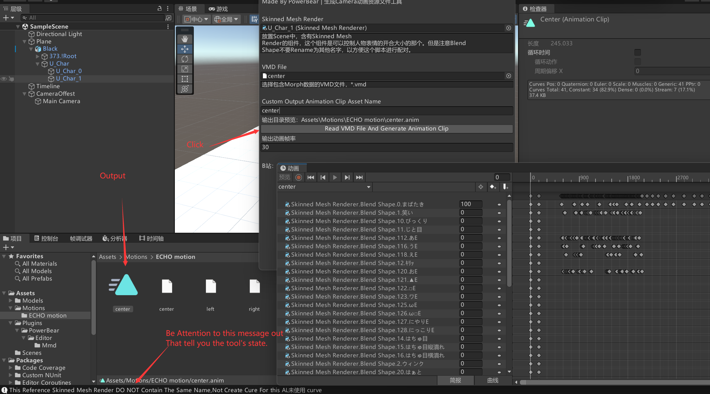
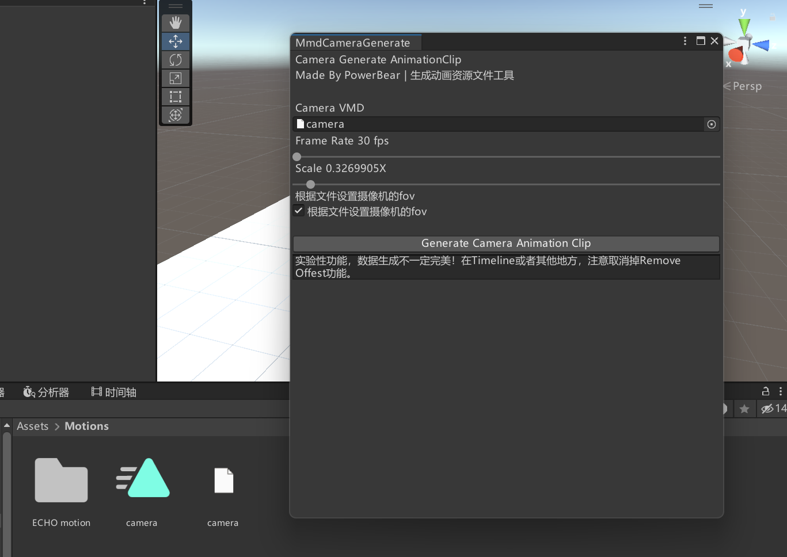
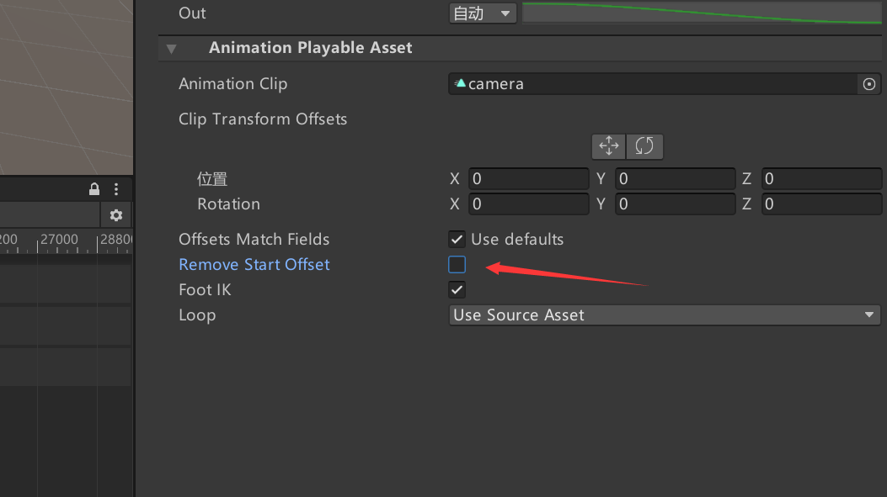

# MMD To Unity Tools
### A Easy way for you to import camear/morph data

This tool is used for MMD4Mecanim to import morph/camera data.So you need to import your model used MMD4Mecanim at first.

Use a graphical interface for interaction.
Pay attention to the console output of the software, which can be very helpful.

This tool Only used a few simple dependencies, so there is no need to configure dependencies,just have fun!

🎞️Get A Video Help See [MMD4Mecanim没法导入表情？快用这个插件导入表情/相机数据文件！超快超轻松~（MMD to Unity 表情）](https://www.bilibili.com/video/BV1DK421x7c2/).哔哩哔哩视频网。
# Install
Download the Release Version From
[Here](Release/PowerBearMMD2UnityTools.unitypackage).

Then double click this file(the unity editor is running in background), and import all assets from this package.

If you can see the "Tool/PowerBear" menu, this means that you have successfully installed it.

# Usage
It's easy to use, follow these steps.
## Import Morph Data
1. Open Tool Window:Tool/MMD Morph Animation Clip Gengerate Tool.

2. Move the file to the corret pleace.

* Notice that Please DO NOT RENAME Morph Name in MMD4Mecanim when import model.Otherwise you will get a empty animation clip.Because there is no match key in frames.

3. Click the Button, and then get a animation file.

## Import Cameara Data(Experimental)
Similar to the above.

❗This Tool May not run correctly, it is now in the experimental stage.

1. Open Tool Window:Tool/MMD Camera Animation Clip Gengerate Tool.

2. Move the file to the corret pleace.

- the "Scale" will be very useful to scale the animation position.In unity is usually to be set 0.2/0.3 ... You may need to multiple attempt to get a appropriate size.
- Use A Empty GameObject as the Camera Parent component.You can scale(Empty GameObject) X/Y/Z Axis separately to adjust.
- "根据文件设置摄像机的FOV": whether to import FOV data according to the vmd file.

- ❗You must cancel this "Remove Start Offest" setting in Inspector.
3. Click the Button, and then get a animation file.

# Reference
This work refers to some other works,my most sincere thanks to all the authors bellow.
## Code / File Assets
- VMD Parse:  [oguna/MMDFormats](https://github.com/oguna/MMDFormats)
- MMD4Unity Tool: [ShiinaManatsu/MMD4UnityTools](https://github.com/ShiinaManatsu/MMD4UnityTools)
## Art Assets In this file
- Motion/Cameara making: moka
- Modeller(鏡音リン)：Sour暄
# License
See The License File In This Project.

简要说明：您不允许使用本项目在任何的学术目的上（包括投递论文，专利，简历）

本项目享有完整的署名权力，您需要在合适位置上声明本项目名称或地址和使用目的。

大千小熊（哔哩哔哩）
