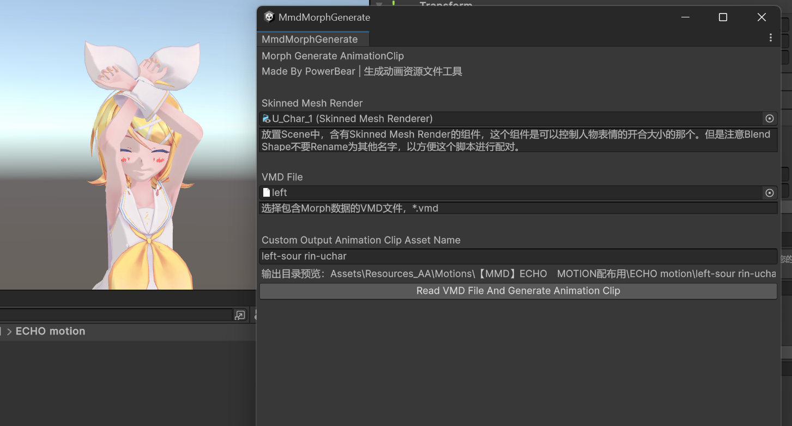
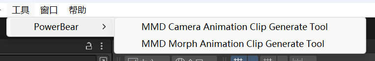
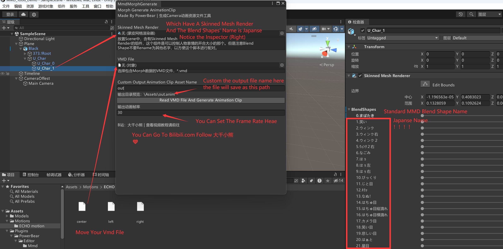
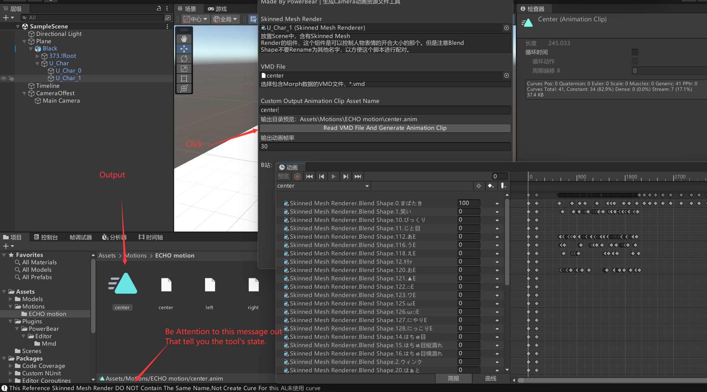
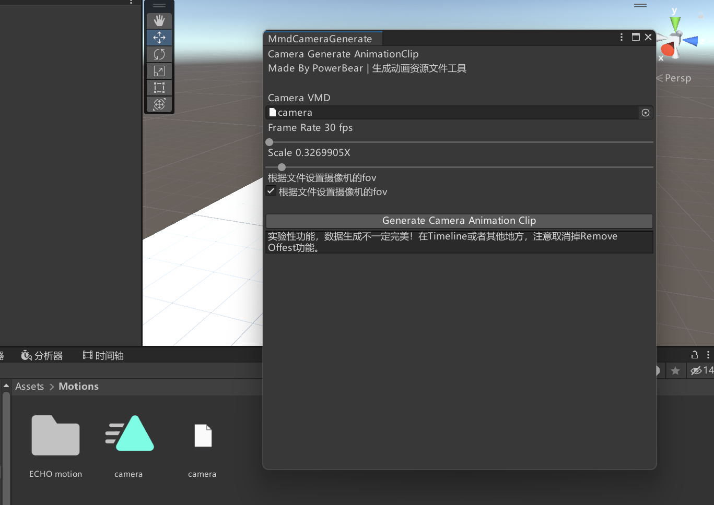
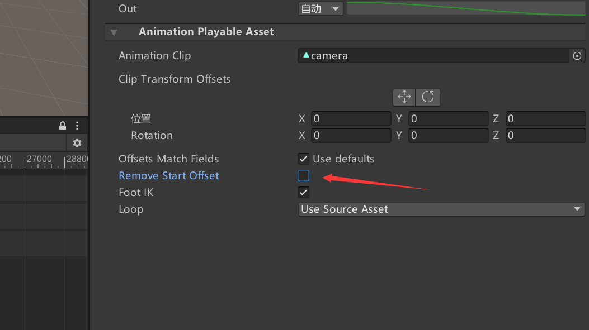
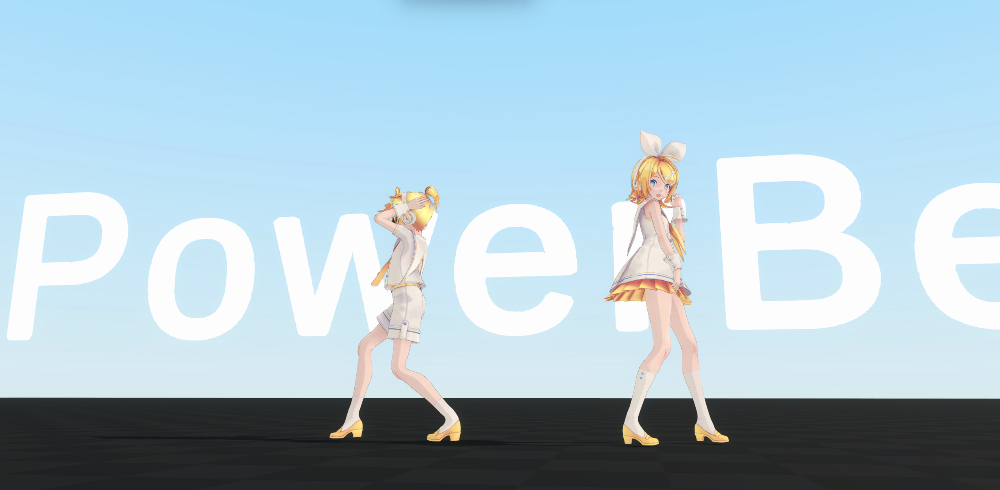

# MMD To Unity Tools
### A Easy way for you to import camear/morph data From MMD To Unity3D

This tool is used for MMD4Mecanim to import morph/camera data.So you need to import your model used MMD4Mecanim at first.

Use a graphical interface for interaction.
Pay attention to the console output of the software, which can be very helpful.

This tool Only used a few simple dependencies, so there is no need to configure dependencies,just have fun!

🎞️Get A Video Help See [MMD4Mecanim没法导入表情？快用这个插件导入表情/相机数据文件！超快超轻松~（MMD to Unity 表情）](https://www.bilibili.com/video/BV1DK421x7c2/).哔哩哔哩视频网。
# Install
Download the Release Version From
[Here](Release/PowerBearMMD2UnityTools.unitypackage).

Then double click this file(the unity editor is running in background), and import all assets from this package.

If you can see the "Tool/PowerBear" menu, this means that you have successfully installed it.

# Usage
It's easy to use, follow these steps.
## Import Morph Data
1. Open Tool Window:Tool/MMD Morph Animation Clip Gengerate Tool.

2. Move the file to the corret pleace.

* Notice that Please DO NOT RENAME Morph Name in MMD4Mecanim when import model.Otherwise you will get a empty animation clip.Because there is no match key in frames.

3. Click the Button, and then get a animation file.

## Import Cameara Data(Experimental)
Similar to the above.

❗This Tool May not run correctly, it is now in the experimental stage.

1. Open Tool Window:Tool/MMD Camera Animation Clip Gengerate Tool.

2. Move the file to the corret pleace.

- the "Scale" will be very useful to scale the animation position.In unity is usually to be set 0.2/0.3 ... You may need to multiple attempt to get a appropriate size.
- Use A Empty GameObject as the Camera Parent component.You can scale(Empty GameObject) X/Y/Z Axis separately to adjust.
- "根据文件设置摄像机的FOV": whether to import FOV data according to the vmd file.

- ❗You must cancel this "Remove Start Offest" setting in Inspector.
3. Click the Button, and then get a animation file.

# Reference
This work refers to some other works,my most sincere thanks to all the authors bellow.
## Code / File Assets
- VMD Parse:  [oguna/MMDFormats](https://github.com/oguna/MMDFormats)
- MMD4Unity Tool: [ShiinaManatsu/MMD4UnityTools](https://github.com/ShiinaManatsu/MMD4UnityTools)
## Art Assets In this file
- Motion/Cameara making: moka
- Modeller(鏡音リン)：Sour暄
# License
See The License File In This Project.

正式场合使用时请在合适的位置上声明本项目名称或地址和使用目的，谢谢您的理解和喜欢。
When using it in formal settings, please indicate the name or address of this project and the purpose of use in an appropriate place. Thank you for your understanding and appreciation.

大千小熊（哔哩哔哩）

===== 2024 3 23 UPDATE =====
- Fix Camera Import Problem, now can import camera data correctly.
- Camera Import Tool now support to set camera FOV / Camera Type(perspective or orthogonality)

Test With 【Echo】（moka） Motion/ Camera Motion

Have Fun With This Update
